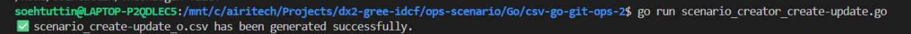

# Technical Procedure: Create new Scenario and deploy it with go-git

## Document Control

| Field | Details |
| --- | --- |
| Document Title | Create, Commit, Update and Delete in github |
| Document ID | TP-GIT-0001 |
| Version | 1.0 |
| Author | Soe Htut Tin |
| Effective Date | 2025-08-13 |
| Review Date | 2025-08-13 |

---

## 1\. Purpose

This procedure provides step-by-step instructions for deploying scripts which is created with `go-git` in `github`.

---

## 2\. Scope

Applicable to all Backend and DevOps team members responsible for github.

---

## 3\. Prerequisites

*   Create new script with Go to generate new scenario
*   Export the `scenario` file with CSV format
*   Access to the repository in `github`
*   Create and update new one to this repository

---

## 4\. Responsibilities

*   **DevOps Engineer:** Create new scripts with Go
*   **IT Operations:** Deploy it to the repository

---

## 5\. Procedure Steps \[Create & Update Functions\]

**Step 1: Downloading**

Download repository in github by using the following command.

```
git clone https://github.com/airitech-soe/csv-go-git-ops.git
```

**Step 2: Checking & Updating**

Type the following commands to check this script.

```
cd csv-go-git-ops
vi scenario_creator_create-update.go
```

If you wanna change CSV file name (eg.scenario\_create-update\_o.csv), you can check on line (10).


Then you need to change folder name on line (23).


You have to change output file name on line (44).


**Step 3: Running**

Type the following command to run the script.

```
go run scenario_creator_create-update.go
```

After you have done this command, you will see like this output if it is completely successful.



**Step 4: Updating**

Update your github URL in the following links.


**Step 5: Running**

Type the following command to run the script.

```
go run scenario_executor_create-update.go --repo csv-go-git-ops --scenario scenario_create-update_o.csv --username airitech-soe --token ghp_UzCBxxxxxxxxxxxxx --log execution_o.log
```
After you have done this command, you will see like this output if it is completely successful.


When we checked it in github, we can see uploaded folders and files in there.

## 6\. Procedure Steps \[File Delete Function\]

**Step 1: Checking & Updating**

Type the following commands to check this script.

```
vi scenario_creator_file_delete.go
```

If you wanna change CSV file name and target files, you can check on line (10, 14 and 15).


If you changed CSV file name, you have to change output file name on line (37).


**Step 2: Running**

Type the following command to run the script.

```
go run scenario_creator_file_delete.go
```
After you have done this command, you will see like this output if it is completely successful.


**Step 3: Checking**

Type the following commands to check this script.

```
vi scenario_executor_file_delete.go
```

**Step 4: Running**

Type the following command to run the script.

```
go run scenario_executor_file_delete.go --repo csv-go-git-ops --scenario scenario_file_delete_m.csv --username airitech-soe --token ghp_UzCBGAKxxxxxxxxxxxxxxxx
```
After you have done this command, you will see like this output if it is completely successful.


When I checked it in github, I can see deleted files (cluster_m/file_0001) in there.

## 7\. Procedure Steps \[Folder Delete Function\]

**Step 1: Checking & Updating**

Type the following commands to check this script.

```
vi scenario_creator_folder_delete.go
```

If you wanna change CSV file name and target folders, you can check on line (10, 14 and 15).


**Step 2: Running**

Type the following command to run the script.

```
go run scenario_creator_folder_delete.go
```
After you have done this command, you will see like this output if it is completely successful.


**Step 3: Checking**

Type the following commands to check this script.

```
vi scenario_executor_folder_delete.go
```
**Step 4: Running**

Type the following command to run the script.

```
go run scenario_executor_folder_delete.go --repo csv-go-git-ops --scenario scenario_folder_delete_k.csv --username airitech-soe --token ghp_UzCBGAKJlxxxxxxxxxx
```
After you have done this command, you will see like this output if it is completely successful.


When I checked it in github, I can see deleted files (cluster_k/cluster_0001) in there.